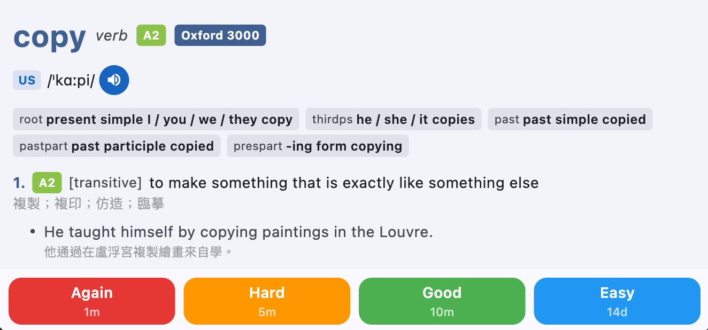
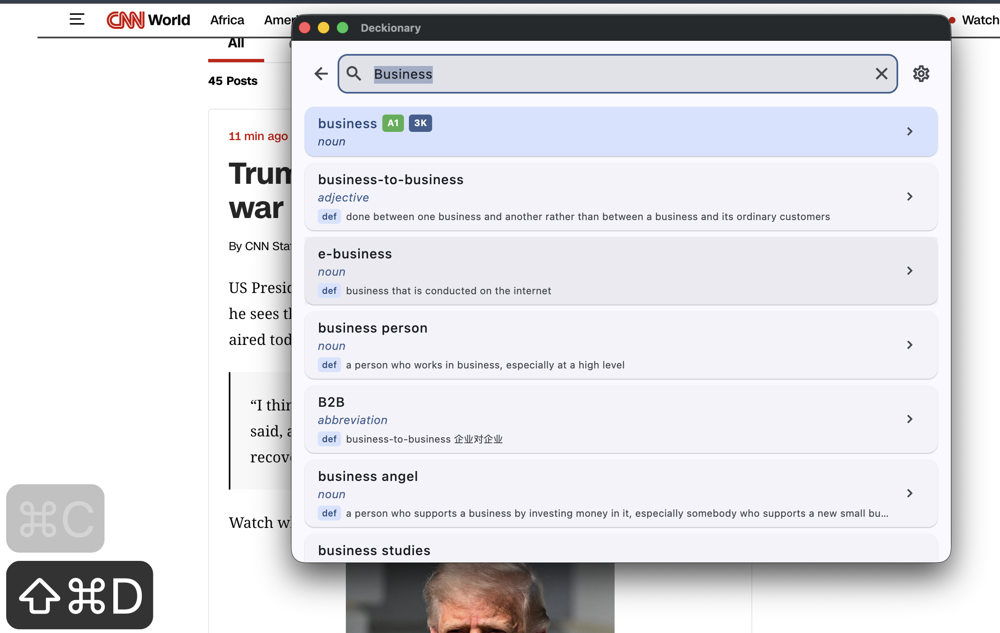

<div align="center">

# Deckionary

**Your Oxford dictionary, your flashcards, one app.**

A dictionary and vocabulary learning app powered by the Oxford Advanced Learner's Dictionary (OALD10) with spaced repetition, instant search, and cross-device sync.

[](#)
[](#)
[](#)

[Download](#download) · [Features](#features) · [繁體中文](README.zh-TW.md)

</div>

---

<!-- Replace these placeholders with actual screenshots -->

<p align="center">
  
  &nbsp;&nbsp;
  
  &nbsp;&nbsp;
  
</p>

---

## Features

### Full Oxford Dictionary at Your Fingertips
Look up any word and get complete OALD10 entries — definitions, example sentences, pronunciations (US & GB), verb forms, collocations, synonyms, word families, and more. Oxford 3000/5000 and CEFR level badges help you focus on the words that matter.

### Learn with Spaced Repetition
<p align="center">
  
</p>
Built-in FSRS flashcard system schedules your reviews at the optimal time. Rate each card (Again / Hard / Good / Easy) and the algorithm adapts to your memory. Set daily limits for new cards and reviews to match your pace.

### Instant Search on macOS
<p align="center">
  
</p>
Press **Cmd+Shift+D** from any app to pop up the dictionary — no need to switch windows. It even reads your clipboard so you can copy a word and look it up in one shortcut. Works across all desktops and displays.

### Sync Across Devices
Sign in with Google and your search history, flashcard progress, and settings follow you everywhere. Works offline first — everything syncs when you're back online.

### Listen and Pronounce
Tap to hear US or British pronunciation for headwords, verb forms, and example sentences. Enable auto-pronounce to hear every word as you search or review.

## Download

Get the latest release from [GitHub Releases](https://github.com/Dragon-Huang0403/Deckionary/releases):

- **macOS** — `.zip` (universal binary)
- **Android** — `.apk`
- **iOS** — coming soon

### macOS Installation

The app is ad-hoc signed but not notarized (no paid Apple Developer account), so macOS attaches a quarantine flag to browser downloads that Gatekeeper refuses to run. One-time fix:

1. Download **Deckionary-macOS.zip** from the [latest release](https://github.com/Dragon-Huang0403/Deckionary/releases/latest) and extract it.
2. Move **Deckionary.app** to `/Applications`.
3. Open **Terminal** and run:
   ```bash
   xattr -cr /Applications/Deckionary.app
   ```
4. Open the app normally.

`xattr -cr` clears the `com.apple.quarantine` extended attribute macOS adds to downloaded files. The app itself is still ad-hoc signed and passes `codesign --verify --deep --strict`.

---

## Development

### Prerequisites

**1. Flutter SDK — pinned via [fvm](https://fvm.app)**

The exact Flutter version lives in `app/.fvmrc` and is the single source of truth: `fvm`
reads it locally and every CI workflow reads the same file via
`subosito/flutter-action`'s `flutter-version-file`. Local and CI therefore cannot drift, and
a new Flutter stable release can never break the build on its own.

```bash
brew install fvm
cd app && fvm install          # installs exactly the version in .fvmrc
fvm flutter doctor -v
```

Prefix commands with `fvm` (`fvm flutter …`, `fvm dart …`) so they use the pinned SDK.

**2. Dictionary database** — place `oald10.db` in `app/assets/`:

```bash
# Option A: Copy from project root (after running build_db.py)
cp oald10.db app/assets/oald10.db

# Option B: Download from R2
curl -fSL -o app/assets/oald10.db \
  https://r2.deckionary.com/db/oald10.db
```

The file is ~210 MB and not checked into git.

**3. Firebase config** — `lib/firebase_options.dart` is gitignored but imported
unconditionally by `lib/main.dart`, so the project will not compile without it:

```bash
npm install -g firebase-tools
fvm dart pub global activate flutterfire_cli
gem install --user-install xcodeproj   # flutterfire edits the Xcode project via this gem
firebase login
cd app && fvm exec flutterfire configure \
  --project=deckionary --platforms=macos,ios,android \
  --macos-bundle-id=com.deckionary.deckionary \
  --ios-bundle-id=com.deckionary.deckionary \
  --android-package-name=com.deckionary.deckionary
```

This also writes `ios|macos/Runner/GoogleService-Info.plist` and
`android/app/google-services.json`. Two gotchas:

- Use `fvm exec flutterfire`, not bare `flutterfire` — the pub-global wrapper invokes
  `dart`, which is not on `PATH` when the SDK is fvm-managed. Alternatively run
  `fvm global <version>` once and put `$HOME/fvm/default/bin` on your `PATH`.
- `flutterfire` also rewrites the `web` app id in the tracked `app/firebase.json`, even when
  `--platforms` excludes web. Check `git diff app/firebase.json` afterwards and revert it
  unless you meant to change it.

**4. macOS/iOS builds** additionally need Xcode (not just Command Line Tools) and
CocoaPods (`brew install cocoapods`).

### Build & Run

```bash
cd app
fvm flutter pub get
fvm flutter run --dart-define-from-file=env.json
```

Without `env.json`, the app runs in local-only mode (no sync).

### Building macOS without an Apple Developer certificate

The Xcode project signs with an `Apple Development` identity and team `MDTULLV9BQ`. Without
that certificate in your keychain, `flutter build macos` fails with `No profiles for
'com.deckionary.deckionary' were found`. Build unsigned and ad-hoc sign afterwards — the
same thing CI does:

```bash
cd app
XCODE_XCCONFIG_FILE=$PWD/macos/Unsigned.xcconfig \
  fvm flutter build macos --release --dart-define-from-file=env.json
codesign --force --deep --sign - build/macos/Build/Products/Release/Deckionary.app
open build/macos/Build/Products/Release/Deckionary.app
```

The `codesign` step is not optional — macOS refuses to run an unsigned bundle. The result
is ad-hoc signed and not notarized, exactly like the published releases, so the
[`xattr -cr` note](#macos-installation) applies if you move it around.

For `flutter run` during development, set `XCODE_XCCONFIG_FILE` the same way. Signing in to
Xcode with a free Apple ID (Settings → Accounts) is the alternative: a personal team issues
development certificates at no cost, and then plain `flutter run` works.

### Upgrading Flutter

Upgrades are deliberate, never automatic. Bump the pin and regenerate the lockfile in the
same commit:

```bash
cd app
# edit .fvmrc to the new version
fvm install
fvm flutter pub get                    # regenerates pubspec.lock
fvm flutter analyze --fatal-warnings   # fix any new lints before committing
```

Commit `.fvmrc` and `pubspec.lock` together — CI runs `flutter pub get --enforce-lockfile`,
so a lockfile that doesn't match the pinned SDK fails the build.

### Project Structure

```
app/
  lib/
    features/
      dictionary/       # Search, autocomplete, entry display
      review/           # FSRS spaced repetition
      settings/         # App configuration
    core/
      database/         # Drift ORM, DAOs
      audio/            # Pronunciation playback & caching
      sync/             # Supabase sync service
  macos/                # macOS-specific (hotkey, tray, window)
  ios/                  # iOS target
  android/              # Android target

db/                     # Python: SQLite schema, parser, importer
scripts/                # R2 export & upload
docs/                   # Guides
```

### Architecture

- **State management** — Riverpod
- **Database** — Drift (SQLite ORM). Two databases: read-only dictionary (`oald10.db`) + read-write user data
- **Spaced repetition** — FSRS-4.5 via the `fsrs` package
- **Audio** — just_audio with SQLite-backed offline cache
- **Sync** — Firebase Auth (Google Sign-in) + Supabase (data storage, RLS)
- **Routing** — go_router

<details>
<summary><strong>Firebase & Supabase Setup</strong> (required only for sync)</summary>

#### Firebase

```bash
dart pub global activate flutterfire_cli
cd app
flutterfire configure
```

This generates `lib/firebase_options.dart` (gitignored). Enable **Authentication > Google** in the [Firebase Console](https://console.firebase.google.com).

#### Google Sign-In (macOS)

Create an **iOS OAuth client ID** in [Google Cloud Console > Credentials](https://console.cloud.google.com/apis/credentials) with bundle ID `com.deckionary.deckionary`. Add the client ID to `macos/Runner/Info.plist`:

```xml
<key>GIDClientID</key>
<string>YOUR_CLIENT_ID.apps.googleusercontent.com</string>
<key>CFBundleURLTypes</key>
<array>
  <dict>
    <key>CFBundleURLSchemes</key>
    <array>
      <string>com.googleusercontent.apps.YOUR_CLIENT_ID</string>
    </array>
  </dict>
</array>
```

#### Supabase

```bash
cp env.example.json env.json
```

Fill in `SUPABASE_URL` and `SUPABASE_ANON_KEY` from **Supabase Dashboard > Settings > API**.

Enable **Firebase** as a third-party auth provider in **Supabase Dashboard > Auth > Third-party providers**.

Apply migrations:

```bash
supabase link --project-ref <your-project-ref>
supabase db push
```

#### macOS Signing

```bash
open macos/Runner.xcodeproj
```

In Xcode: **Runner target > Signing & Capabilities > Automatically manage signing > select Team**. Same for **RunnerTests**.

</details>

<details>
<summary><strong>Python Tools</strong></summary>

```bash
python3 -m venv .venv && source .venv/bin/activate
pip install flask opencc-python-reimplemented

python build_db.py          # Build oald10.db from macOS dictionary bundle
python app.py --port 8000   # Web dictionary browser
```

See `docs/` for detailed guides on the database schema and R2 export.

</details>
